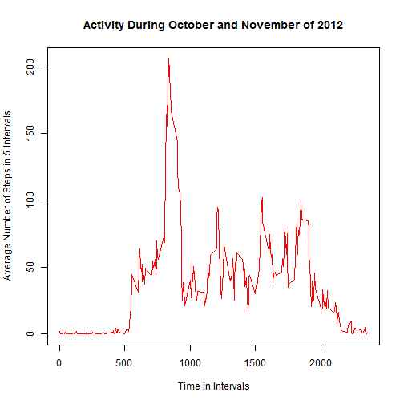
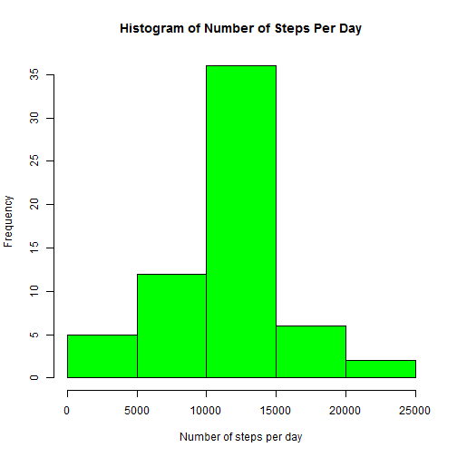
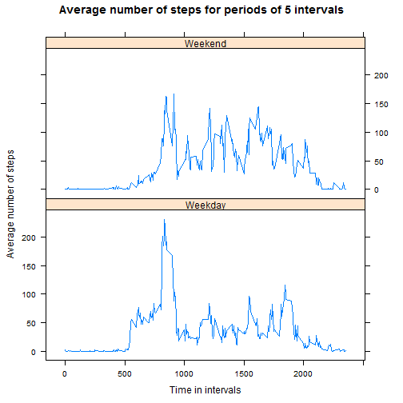

  Reproducible Research: Peer Assessment 1
=====================================================

The given input data is from a personal activity monitoring device collected at 5 minute intervals through out the day. It is comprised of data from an anonymous individual collected during the months of October and November, 2012 and include the number of steps taken in 5 minute intervals each day. We are required to answer a given set of questions. This is accomplished incrementally in five steps, answering one of the follwing questions in each step:

1. How do you load and preprocess the data?
2. What is the mean total number of steps taken per day?
3. What is the average daily activity pattern?
4. How do you deal with Imputing missing values and what is its impact on the mean and the median?  
5. Are there differences in activity patterns between weekdays and weekends?


###Step 1: How do you load and preprocess the data.

A simple *read.csv* command is used to read the input file into a data frame 
called **ActivityDF**. We then examine the data using the *head* command as shown below. From examining the first few rows of the input data, it is clear that some of the observations (rows) are missing values for the **steps** variable.


```r
ActivityDF <- read.csv("activity.csv")
head(ActivityDF)
```

```
##   steps       date interval
## 1    NA 2012-10-01        0
## 2    NA 2012-10-01        5
## 3    NA 2012-10-01       10
## 4    NA 2012-10-01       15
## 5    NA 2012-10-01       20
## 6    NA 2012-10-01       25
```

In this project we plan to use *dplyr* for the speed and convenience it offers and therefore we convert the input data from a data frame to a data frame table. As mentioned in the dplyr vignette on CRAN, dplyr verbs can work with data frames as is, but if you're dealing with large data, it's worthwhile to convert them to a data frame table (tbl_df), which is a wrapper around a data frame that won't accidentally print a lot of data to the screen. Note that by default only 10 rows of the data frame table are displayed.


```r
library(dplyr)
```

```r
ActivityDFTbl <- tbl_df(ActivityDF)
ActivityDFTbl
```

```
## Source: local data frame [17,568 x 3]
## 
##    steps       date interval
## 1     NA 2012-10-01        0
## 2     NA 2012-10-01        5
## 3     NA 2012-10-01       10
## 4     NA 2012-10-01       15
## 5     NA 2012-10-01       20
## 6     NA 2012-10-01       25
## 7     NA 2012-10-01       30
## 8     NA 2012-10-01       35
## 9     NA 2012-10-01       40
## 10    NA 2012-10-01       45
## ..   ...        ...      ...
```

###Step2: What is mean total number of steps taken per day?

Since, for this part of the project, we are instructed to ignore the entries with missing values, we create a filtered table (**FiltdTbl**) by  selecting only the rows with valid readings for all variables from **ActivityDFTbl**.


```r
FiltdTbl <- ActivityDFTbl[complete.cases(ActivityDFTbl), ]
FiltdTbl
```

```
## Source: local data frame [15,264 x 3]
## 
##    steps       date interval
## 1      0 2012-10-02        0
## 2      0 2012-10-02        5
## 3      0 2012-10-02       10
## 4      0 2012-10-02       15
## 5      0 2012-10-02       20
## 6      0 2012-10-02       25
## 7      0 2012-10-02       30
## 8      0 2012-10-02       35
## 9      0 2012-10-02       40
## 10     0 2012-10-02       45
## ..   ...        ...      ...
```

Next we write a function **byDateMeanMedian** which takes an input matrix (name of the formal parameter is **IPmatrix**) and outputs the histogram,  the mean, and the median number of steps per day. This function enables us to repeat this process for any other input matrices and we use it in Step 4 of this project.   


```r
byDateMeanMedian <- function(IPmatrix){
  #Grouping by date since we need to find the average number of steps per day
  GroupedByDate <- group_by(IPmatrix,date)
  TotalStepsTbl <- summarize(GroupedByDate, TotalSteps = sum(steps))
  #Plot the histogram
  hist(TotalStepsTbl$TotalSteps, col = "green", main = "Histogram of Number of Steps Per Day", xlab = "Number of steps per day")
  #Computing Mean and Median number of steps per day
  MeanStepsPerDay <- mean(TotalStepsTbl$TotalSteps)
  MedianStepsPerDay <- median(TotalStepsTbl$TotalSteps)
  res <- numeric(2)
  res <- c(MeanStepsPerDay,MedianStepsPerDay) 
  res
}
```
 
Plotting the histogram and computing the mean and the median number of steps per day. 


```r
result <- byDateMeanMedian(FiltdTbl)
```

-1.png) 

**The mean is 1.0766189 &times; 10<sup>4</sup> and the median is 1.0765 &times; 10<sup>4</sup>.**

###Step2: What is the average daily activity pattern?
For this part of the project we need to compute the average steps per interval for all intervals of a day and therefore we group the data by *interval*  and plot the result.


```r
#Group the data by interval 
GroupedByInterval <- group_by(ActivityDFTbl, interval)
StepsPerInterval <- summarize(GroupedByInterval, AvgSteps = mean(steps, na.rm = TRUE))
#Plot the result
with(StepsPerInterval, plot(interval,AvgSteps, type = "l", main = "Activity During October and November of 2012", xlab = " Time in Intervals", ylab = "Average Number of Steps in 5 Intervals", col = "red"))
```

 

**Observation**: from the plot we see that the average number of steps seems to be 


- close to zero till about 500 intervals;
- fluctuating between 50 and 100 for intervals between approximately 500 to 1800, except;
- has peak value going upto 200 for intervals between 750 and 950.
- After 1800, the activity seems to taper off. 

###Step3: Which 5-minute interval, on average across all the days in the dataset, contains the maximum number of steps?

We just sort the rows of the table in descending order of the Average number of steps per interval (**AvgSteps**) and the interval number of the first row of the resulting table gives us the answer. 


```r
SortedTbl <- arrange(StepsPerInterval, desc(AvgSteps))
```


The 5-minute interval, on average across all the days in the dataset, that contains the maximum number of  steps is 835.

### Step 4: How do you deal with Imputing missing values and what is its impact on the mean and the median? 

We now answer the series of questions given to us.


```r
#Computing the number of rows with a missing value
NumRowsMissingVals <- sum(!complete.cases(ActivityDFTbl))
```
The number of rows with missing values are 2304.

We create a new table, named **NewTable**, with the missing values substituted by 
the average number of steps per interval computed earlier and stored in the data table **StepsPerInterval**. Note that for each interval, this average number of steps is different and we need to use the right number in each row of **NewTable**. 


```r
#filling in missing values with the known average number of steps for that interval
NewTable <- ActivityDFTbl
for (i in 1:17568){
	if (is.na(NewTable$steps[i])){
		intervalVal <- NewTable$interval[i]
          	Row <- filter(StepsPerInterval, interval == intervalVal)
		NewTable$steps[i] <- Row[[1,2]]
}}

#Drawing the histogram and computing the mean and the median number of steps per day.
NewVals <- byDateMeanMedian(NewTable)
```

 

**Comparing the mean and the median**: With the missing values substituted, the values of the mean and the median are 1.0766189 &times; 10<sup>4</sup> and 1.0766189 &times; 10<sup>4</sup>, respectively. When the missing values were ignored the corresponsing numbers were 1.0766189 &times; 10<sup>4</sup> and 1.0765 &times; 10<sup>4</sup>. 

With the substitution scheme used by us, the mean and the median were both equal to the mean of the original calculation, by ignoring the missing values. 
 

###Step 5. Are there differences in activity patterns between weekdays and weekends?

To answer this question we need to be able to do a plot of the average steps per interval on a weekday and that on a weekend. This task involves several subtasks.

The following function **FindWhatDay** takes a date string as the input and gives an output "Weekday" or "Weekend". We use this function to add a colum  'DayOfWeek' to NewTable as shown below.


```r
# function that finds whether a string representing a date is a "weekday" or a "weekend"
FindWhatDay <- function(date){
	dayOfWk = weekdays(as.Date(as.character(date)))
      if((dayOfWk == "Sunday")||(dayOfWk == "Saturday")) (day <- "Weekend")
      	else (day <- "Weekday")
      day
}
#Use the above function to add a column in the activity matrix to indicate whether it is a weekday or a weekend
Day <- sapply(NewTable$date, FindWhatDay)
Day <- factor(Day)
NewTable <- mutate(NewTable, DayOfWeek = Day)
```

Now that we have the information of the day of week in the NewTable we go on to create the summary of Average number of steps per interval with the data partitioned by "Weekday" or "Weekend". There were several other computations required before we were able to get the required plot. For the interested reader there are comments in the code that can explain. The str() command is used to illustrate the structure and help understand the manipulations. 


```r
#Plotting 
library(lattice)
library(stringr)
library(tidyr)

#Creating a new variable IntervalDay for grouping by 
temp <- as.character(NewTable$DayOfWeek)
NewCol <- paste0(NewTable$interval,temp)
str(NewCol)
```

```
##  chr [1:17568] "0Weekday" "5Weekday" "10Weekday" "15Weekday" ...
```

```r
TempNewTable <- mutate(NewTable, IntervalDay = NewCol)
str(TempNewTable)
```

```
## Classes 'tbl_df', 'tbl' and 'data.frame':	17568 obs. of  5 variables:
##  $ steps      : num  1.717 0.3396 0.1321 0.1509 0.0755 ...
##  $ date       : Factor w/ 61 levels "2012-10-01","2012-10-02",..: 1 1 1 1 1 1 1 1 1 1 ...
##  $ interval   : int  0 5 10 15 20 25 30 35 40 45 ...
##  $ DayOfWeek  : Factor w/ 2 levels "Weekday","Weekend": 1 1 1 1 1 1 1 1 1 1 ...
##  $ IntervalDay: chr  "0Weekday" "5Weekday" "10Weekday" "15Weekday" ...
```

```r
NewerTable <- group_by(TempNewTable, IntervalDay)

#Summarizing the results for the plot
SummaryTable <- summarize(NewerTable, AvgStepsPerInterval = mean(steps))
str(SummaryTable)
```

```
## Classes 'tbl_df', 'tbl' and 'data.frame':	576 obs. of  2 variables:
##  $ IntervalDay        : chr  "0Weekday" "0Weekend" "1000Weekday" "1000Weekend" ...
##  $ AvgStepsPerInterval: num  2.251 0.215 37.875 48.133 18.22 ...
##  - attr(*, "drop")= logi TRUE
```

```r
#Adding the DayOfWeek and the interval variables to the SummaryTable
SummaryTable <- mutate(SummaryTable, DayOfWeek = str_sub(IntervalDay, start = -7), interval = extract_numeric(IntervalDay))
SummaryTable$DayOfWeek <- factor(SummaryTable$DayOfWeek)
SummaryTable <- arrange(SummaryTable, interval)
str(SummaryTable)
```

```
## Classes 'tbl_df', 'tbl' and 'data.frame':	576 obs. of  4 variables:
##  $ IntervalDay        : chr  "0Weekday" "0Weekend" "5Weekday" "5Weekend" ...
##  $ AvgStepsPerInterval: num  2.2512 0.2146 0.4453 0.0425 0.1732 ...
##  $ DayOfWeek          : Factor w/ 2 levels "Weekday","Weekend": 1 2 1 2 1 2 1 2 1 2 ...
##  $ interval           : num  0 0 5 5 10 10 15 15 20 20 ...
```

```r
#Plotting using SummaryTable
xyplot(AvgStepsPerInterval~interval|DayOfWeek, SummaryTable, layout = c(1,2), type = "l", xlab = "Time in intervals", ylab = "Average number of steps", main = "Average number of steps for periods of 5 intervals")
```

 

**Observations**:

- On weekends the activity seems to increase very gradually starting around 600 whereas during the weekdays at about 500 the activity increases abruptly from 0 to 50 steps (duirng 5 intervals)

- On weekdays the activity fluctuates between 50 and 100 from 500 to 1750 whereas during weekends the activity fluctuates between 50 and 125 steps from 600 to  about 2000 intervals.

- on weekdays there is a marked spike in the activity reaching beyond 200 steps, between 800 to 950 intervals and on weenends this spike is not so marked. 

- on weekdays the activity starts subsiding around 1900 intervals whereas during the weenends it subsides only at 2000 intervals. 


